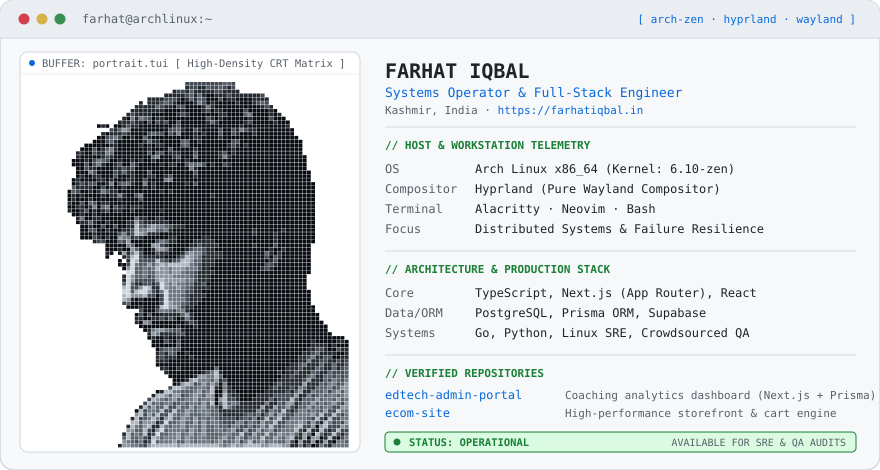

<div align="center">
  <a href="https://farhatiqbal.in">
    <picture>
      <source media="(prefers-color-scheme: dark)" srcset="dark_mode.svg">
      
    </picture>
  </a>
</div>

<br>

### Flagship Systems &amp; Architectures

#### 01 / [oorbE](https://github.com/farhatkoka/oorbE)
`Kotlin` `Android Multi-Module` `Jetpack Compose` `Shizuku IPC` `Biometrics`
> Enterprise 17-module modular Android architecture featuring privileged Shizuku system-level IPC, biometric vault encryption, and unidirectional reactive state streams.

#### 02 / [finbook](https://github.com/farhatkoka/finbook)
`Kotlin` `Room SQLite` `React PWA` `Supabase` `Offline-First`
> Dual-runtime financial accounting and ledger engine combining an offline-first native Android core with a cross-platform React PWA and automated invoice reporting.

#### 03 / [tui-profile](https://github.com/farhatkoka/tui-profile)
`Python` `NumPy` `Pillow` `SVG Vector Engine` `Open Source`
> Pure vector CRT phosphor terminal generator converting any avatar into an adaptive dark/light GitHub profile dashboard with zero external API dependencies.

#### 04 / [edtech-admin-portal](https://github.com/farhatkoka/edtech-admin-portal)
`Next.js (App Router)` `Prisma ORM` `PostgreSQL` `Recharts`
> Full-stack coaching management and institutional analytics dashboard with dynamic batch coordination, session auth, and real-time performance metrics.

#### 05 / [ecom-site](https://github.com/farhatkoka/ecom-site)
`Next.js` `TypeScript` `Tailwind CSS`
> High-performance artisanal e-commerce storefront engineered for sub-second page transitions, modular cart state isolation, and responsive mobile checkout flows.

#### 06 / [web-invitation](https://github.com/farhatkoka/web-invitation)
`React` `Tailwind CSS` `Framer Motion`
> High-fidelity interactive digital event gateway with dynamic multimedia sequences, responsive layout breakpoints, and touch-optimized gestures.

<br>

### Telemetry &amp; Comms

```bash
Workstation  :: Arch Linux x86_64 (6.10-zen) · Hyprland Wayland · Alacritty
Tooling      :: Neovim · Bash · Docker · Git
Core Stack   :: Kotlin · TypeScript · Next.js · Go · Python · PostgreSQL · Prisma
Eng Mission  :: Production Reliability · Zero-Regression Architectures · SRE Audits
Direct       :: https://farhatiqbal.in · farhatkoka
```
